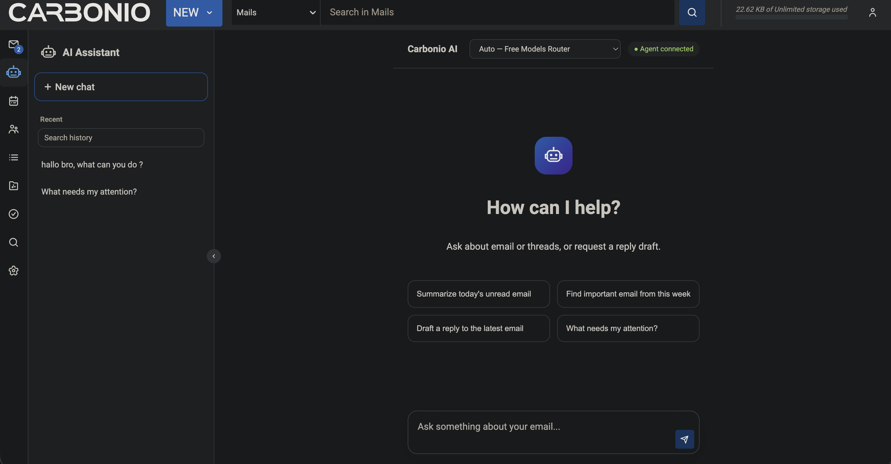

# Carbonio AI Assistant

Standalone AI assistant for Carbonio Webmail, delivered as an independent Carbonio
microfrontend and a private server-side gateway. It adds a ChatGPT-style workspace without
replacing or modifying the existing Mail application.

**Stable release:** [`v1.1.0`](https://github.com/afatyoo/carbonio-ai-assitant/releases/tag/v1.1.0)

**Deployment class:** controlled Carbonio production pilot with documented known limitations

**License:** [MIT](LICENSE)



For exact release evidence, the closed-bug ledger, and authenticated UAT results, read the
[v1.1.0 release report](docs/releases/v1.1.0.md).

## What v1.1.0 includes

### Urgent model and response fixes

- Settings exposes the effective provider and model plus environment-managed field locks.
- Effective configuration changes invalidate stale saved account model preferences.
- Historical conversations no longer override the model used for a new request.
- Assistant answers are displayed as safe readable plain text without literal Markdown
  emphasis, headings, horizontal rules, or raw labeled millisecond timestamps.

### Context-aware side panel

- Carbonio Shell shows a compact AI utility panel on Mail and Calendar routes without
  modifying either core application.
- Selected email, conversation, or appointment context is off by default and requires an
  explicit per-selection user opt-in.
- The browser sends only a typed reference. The gateway validates it and re-fetches the exact
  item with the active authenticated Carbonio session before calling the AI provider.
- Changing the selected item aborts in-flight work, clears the panel, and resets consent.
- Email summary, action-item extraction, reply drafting, meeting preparation, follow-up, and
  free-form context questions share the same server-side history as full chat.
- The compact panel never executes write confirmations. Review write actions in full chat.
- Every panel label and privacy notice is available in all nine official interface languages.

### Languages

The assistant follows Carbonio's selected Web GUI language for all addon-owned interface,
status, Settings, history, and confirmation text. The official catalogs are English (`en`),
French (`fr`), Hindi (`hi`), Indonesian (`id`), Italian (`it`), Brazilian Portuguese (`pt`),
Russian (`ru`), Spanish (`es`), and Thai (`th`). Regional variants such as `pt-BR` and `id-ID`
resolve to their supported base locale. Unsupported community locales fall back to English.

The seven catalogs introduced in v1.0.1 are high-quality first-pass translations without
native linguistic sign-off. AI answers, mailbox content, document excerpts, citations, and
raw external provider errors are not translated automatically.

### Assistant and conversation history

- A robot-icon entry in Carbonio's primary navigation and a dedicated assistant route.
- English and Indonesian UI selected through Carbonio localization.
- Streamed AI responses with localized progress markers, cancellation, retry, regenerate,
  and visible request IDs.
- Server-side PostgreSQL history isolated by the authenticated Carbonio account ID.
- Conversation search, cursor pagination, inline rename, soft-delete, and Undo/restore.
- Per-conversation model selection constrained by administrator policy.

### Email

- Bounded email and thread search, unread listing, exact message retrieval, safe HTML-to-text
  normalization, summaries, action items, people/date extraction, and attachment metadata.
- New, reply, forward, and update-draft previews.
- Controlled save-draft, send, mark-read, tag, move, and permanent-delete actions.
- Exact-target resolution, risk classification, audit records, one-time confirmation tokens,
  and idempotency protection for mutations.

### Calendar and contacts

- Appointment search and exact retrieval.
- Contact/GAL attendee resolution, free/busy checks, timezone-aware slot proposals, and
  conflict detection.
- Calendar draft, appointment creation/update, invitation, and cancellation previews.
- Carbonio `ms`/`rev` stale-version protection and rejection of ambiguous recurring-event
  mutations.

### Providers, policy, and operations

- Presets for OpenRouter, OpenAI, Anthropic/Claude, DeepSeek, Gemini, and explicitly
  allowlisted custom OpenAI-compatible endpoints.
- Administrator-owned provider credentials and account/group/domain model policies.
- Account quotas, tool permissions, write-tool kill switch, and emergency addon disable.
- Structured logs, correlated request IDs, provider retry/timeout/circuit breaker, metrics,
  production smoke checks, backup, rollback, and uninstall tooling.

## RAG scope

v1.1.0 includes a curated local lexical index of official Carbonio email SOAP API
documentation. It can ground supported API and email-composition guidance and return source
metadata for citations.

This is documentation grounding, not full mailbox, attachment, file, or workspace vector RAG.
The release does not:

- create mailbox or attachment embeddings.
- install or query `pgvector`.
- index every user's email, Files content, shared folders, or private workspace.
- synchronize a vector index when source content, permissions, or retention state changes.
- extract arbitrary attachment bodies for provider upload.

Mailbox and calendar data is fetched on demand through bounded Carbonio SOAP tools using
the active user's session. Production-ready user/workspace vector RAG, including controlled
import, ACL revalidation, deletion propagation, hybrid retrieval, reranking, and cross-user
isolation, is deferred to the separate production RAG plan.

## Architecture

```text
Carbonio Web UI
  └── carbonio-ai-assistant-ui microfrontend
          │ same-origin /api/ai/*
          ▼
Carbonio Nginx
          │ loopback proxy
          ▼
carbonio-ai-gateway.service (127.0.0.1:8787)
  ├── verifies the Carbonio session with GetInfo
  ├── calls bounded Carbonio SOAP email/calendar tools
  ├── calls the configured AI provider with minimized context
  └── stores owner-scoped conversation history in PostgreSQL
```

The browser never receives the provider API key or direct database credentials. The gateway
does not trust an account ID supplied by the browser. It derives ownership from the active
Carbonio session.

## Tested environment

The stable production-pilot evidence was collected on:

- Carbonio Advanced 26.6.2 on Ubuntu 24.04.
- Carbonio Shell UI 15.1.0.
- a single Carbonio Proxy/Web UI/Mailstore host.
- PostgreSQL 16 on the same pilot host.
- Chrome with the internal Carbonio CA trusted.
- packaged Node.js v22.22.0 for the gateway.

The UI targets the latest two major Chrome, Firefox, Edge, and Safari versions, subject to
the installed Carbonio version's own browser matrix. Only the authenticated Chrome path is
part of the current live UAT evidence. See [browser support](docs/browser-support.md).

## Known limitations

The project owner accepted the following external gates for v1.1.0 as known limitations.
Risk acceptance permitted the stable release. It did **not** convert missing evidence into
a pass:

1. logout/login/login-again persistence with a known pilot password.
2. authenticated Firefox desktop and narrow-layout coverage.
3. a real non-administrator Settings boundary test.
4. large-mailbox bounded-search and performance acceptance.
5. live attachment handling with a dedicated safe fixture.
6. the remaining calendar mutation lifecycle and confirmation-replay checks.
7. Carbonio upgrade rehearsal on a comparison host.
8. separate staging and PostgreSQL replica/failover rehearsal.

The optional permanent-delete/replay scenario and the `AI-UAT` tag/folder lifecycle also
remain skipped/open. Do not expand beyond the controlled pilot on the basis of untested
browsers, mailbox sizes, upgrade paths, or high-availability behavior. The complete risk
record is in the [v1.1.0 release report](docs/releases/v1.1.0.md#risk-acceptance).

## Security and privacy

- Every protected request verifies the Carbonio session and scopes data by the resolved
  account ID.
- The gateway binds only to `127.0.0.1:8787`. Carbonio Nginx provides the same-origin public
  route and security headers.
- Provider credentials are administrator-owned, encrypted with `systemd-creds`, and never
  echoed to the browser.
- Production history uses a dedicated PostgreSQL database. Message content supports
  AES-256-GCM encryption through `AI_HISTORY_ENCRYPTION_KEY`.
- Search/list tools return bounded results and do not fetch every message body. Attachment
  tools expose metadata only unless a future reviewed flow explicitly adds content handling.
- Email and calendar mutations show an exact preview and require an account-bound,
  single-use confirmation token. Preview generation alone never executes a mutation.
- Explicit English or Indonesian instructions not to access mailbox/calendar data bypass
  Carbonio tools, documentation RAG, and synthetic tool context.
- Production OpenRouter calls enforce `data_collection: "deny"` and `zdr: true`. Keep
  provider-side logging, prompt publication, training, and data discounts disabled.
- Free models are suitable for controlled functional testing, not an SLA-backed or
  confidential-data rollout. Select an approved paid or self-hosted endpoint for production
  workloads after a privacy review.

Read the [provider data policy](docs/provider-data-policy.md) and
[administrator policy](docs/admin-policy.md) before enabling real users.

## Using the assistant

### User workflow

1. Sign in to Carbonio and select the robot icon in the primary navigation.
2. Choose a model from the administrator-approved list. If only one model is allowed, it is
   selected automatically.
3. Ask a bounded question such as "Summarize today's unread email" or "Find messages from
   Alice this week." Read operations do not mark messages as read.
4. For a draft or mutation, inspect the exact target, recipients, destination, or calendar
   before/after preview.
5. Confirm only the intended action. Confirmation is single-use. A changed or ambiguous
   target fails closed.
6. Use history search, rename, delete, and Undo from the conversation sidebar.
7. When reporting a failure, copy the request ID shown by the UI so an administrator can
   correlate it with the gateway log.

### Administrator workflow

1. Add only approved pilot identities to `AI_ENABLED_ACCOUNTS`. Keep write access narrower
   through `AI_WRITE_TOOL_ACCOUNTS`.
2. Add administrator identities to `AI_ADMIN_ACCOUNTS`. An empty list grants no one admin
   access.
3. Configure the provider preset, endpoint policy, model allowlist, scoped model/tool
   policies, daily quotas, and privacy disclosure in Settings or the root-owned environment.
4. Install or rotate the provider API key with the encrypted credential helper.
5. Monitor provider status, usage, metrics, audit records, and request-correlated journald
   output. Use the write kill switch before maintenance or incident investigation.

Example policy values are documented in [admin-policy.md](docs/admin-policy.md). Do not put
an API key directly in `gateway.env`.

## Production prerequisites

The Carbonio Proxy/Web UI host must provide:

- a supported Carbonio installation with Iris at `/opt/zextras/web/iris` and Carbonio Nginx.
- root access for installation and service management.
- PostgreSQL plus `psql`, `createuser`, `createdb`, `pg_dump`, and `pg_restore`.
- `curl`, `jq`, `tar`, `sha256sum`, `openssl`, `systemctl`, and `systemd-creds`.
- outbound HTTPS access to download the pinned Node runtime when it is not already present.
- outbound HTTPS access to the chosen AI provider.
- a Webmail certificate trusted by pilot browsers.
- a maintenance window, a verified backup destination, and an approved rollback commit.

The installer downloads and verifies the pinned official Node 22 runtime, installs the UI
and gateway into versioned directories, registers the Iris component, installs the Nginx
route, and manages `carbonio-ai-gateway.service` through systemd.

## Production deployment

Deploy from the public release artifact, not an arbitrary branch checkout. Run the following
inside a dedicated staging directory on the Carbonio Proxy/Web UI host:

```bash
mkdir carbonio-ai-v1.1.0
cd carbonio-ai-v1.1.0
curl -fLO https://github.com/afatyoo/carbonio-ai-assitant/releases/download/v1.1.0/carbonio-ai-assistant-v1.1.0.tar.gz
curl -fLO https://github.com/afatyoo/carbonio-ai-assitant/releases/download/v1.1.0/carbonio-ai-assistant-v1.1.0.tar.gz.sha256
sha256sum --check carbonio-ai-assistant-v1.1.0.tar.gz.sha256
tar -xzf carbonio-ai-assistant-v1.1.0.tar.gz
cd carbonio-ai-assistant-v1.1.0
```

Published archive SHA-256:

```text
1f1b1695a3ec4a084627ded3a111f4b29c3a45a82149da10bec22a04404d6e4f
```

Inspect `release.env` and confirm version `1.1.0`, the approved exact commit, and the Node
runtime before continuing.

### Install the application

```bash
sudo ./install.sh
```

The first install creates the `carbonio-ai` system account, persistent/configuration
directories, versioned UI and gateway releases, the systemd service, and the Carbonio Nginx
extension. It preserves a backup of Iris `components.json`.

### Configure PostgreSQL history

After the application runtime exists, run the packaged database helper:

```bash
sudo /opt/carbonio-ai-assistant/bin/setup-postgres.sh
```

The helper creates the dedicated `carbonio_ai` role/database, generates a database password
and history-encryption key, migrates existing SQLite pilot history when present, writes
`/etc/carbonio-ai-assistant/gateway.env` as root-only mode `0600`, and restarts the gateway.
It replaces database credentials if rerun, so treat reruns as controlled maintenance.

Add site policy to `/etc/carbonio-ai-assistant/gateway.env` without weakening the generated
database settings. Example non-secret policy:

```ini
NODE_ENV=production
AI_ADMIN_ACCOUNTS=admin@example.com
AI_ENABLED_ACCOUNTS=admin@example.com,pilot@example.com
AI_WRITE_TOOL_ACCOUNTS=admin@example.com
AI_PROVIDER_ALLOWLIST=openrouter
AI_MODEL_ALLOWLIST=openrouter/free
AI_REQUESTS_PER_DAY=100
AI_TOKENS_PER_DAY=100000
```

Use real Carbonio account addresses appropriate to the deployment. Keep the pilot and write
allowlists intentionally small. Review all supported scoped-policy options in
[admin-policy.md](docs/admin-policy.md).

### Install the provider credential

Enter the key interactively so it is not written to shell history:

```bash
sudo /opt/carbonio-ai-assistant/bin/set-api-key.sh
```

For an older installation, the helper also supports `--migrate-env` and
`--migrate-config`. It deletes legacy plaintext only after encrypted credential creation
succeeds.

### Verify the deployment

```bash
sudo /opt/carbonio-ai-assistant/bin/smoke-test.sh
systemctl status carbonio-ai-gateway.service --no-pager
curl -fsS http://127.0.0.1:8787/api/ai/health
```

Strict smoke must finish with:

```text
smoke_health=ok headers=ok loopback=ok admin_auth=ok csrf=ok history=postgresql
```

Then hard-refresh authenticated Carbonio Webmail and verify:

1. the robot icon opens the assistant route.
2. provider status is connected and only allowed models appear.
3. an existing conversation still loads from PostgreSQL.
4. a synthetic prompt that explicitly forbids email/calendar access receives an answer
   without mailbox, calendar, confirmation, or mutation events.
5. one approved non-mutating mailbox query behaves as expected.

Do not repeat a live email or calendar mutation without separate action-time approval.

## Upgrade

Before installing a newer verified archive, record the current gateway symlink, active UI
commit, service status, and smoke output. Create and validate a database backup:

```bash
sudo /opt/carbonio-ai-assistant/bin/backup-postgres.sh
sudo pg_restore --list /var/backups/carbonio-ai-assistant/<new-backup-file>.dump
```

Verify the new archive checksum, extract it, inspect `release.env`, and run its installer:

```bash
sudo ./install.sh
sudo /opt/carbonio-ai-assistant/bin/smoke-test.sh
systemctl status carbonio-ai-gateway.service --no-pager
```

The installer atomically switches the versioned gateway symlink and updates the Iris UI
registry. Finish with the authenticated browser checks above. Record the tag, exact commit,
archive checksum, backup path, operator, smoke output, and browser evidence.

## Rollback

Rollback requires a previously installed 40-character commit whose gateway and UI files
still exist on the server:

```bash
sudo /opt/carbonio-ai-assistant/bin/rollback.sh <40-character-commit> --yes
sudo /opt/carbonio-ai-assistant/bin/smoke-test.sh
```

The helper switches UI and gateway together and restores the previous selection if its
health check fails. Database migrations are forward-only: application rollback does not
downgrade PostgreSQL. Database restore is a separate emergency action that stops the
gateway and requires an explicitly selected, catalog-verified backup:

```bash
sudo /opt/carbonio-ai-assistant/bin/restore-postgres.sh --yes /absolute/path/to/backup.dump
```

## Uninstall

Interactive uninstall removes the managed UI, gateway, runtime, systemd service, and Nginx
route while preserving history and saved configuration:

```bash
sudo ./uninstall.sh
```

Non-interactive data-preserving uninstall:

```bash
sudo ./uninstall.sh --yes
```

Destructive uninstall:

```bash
sudo ./uninstall.sh --yes --purge-data
```

`--purge-data` irreversibly drops the `carbonio_ai` database and role, removes persistent
history/configuration, and deletes the service account. Export and validate required data
before using it. The uninstaller refuses to run if the managed-installation marker is
missing.

## Troubleshooting

### `Unexpected token '<'` or an HTML response parsed as JSON

The browser reached an HTML Carbonio route instead of the AI gateway. Confirm that the
Nginx extension files are installed, the gateway is active, and `/api/ai/health` returns
JSON through the intended route. Do not add a browser-side endpoint override as a workaround.

### AI gateway HTTP 405

Confirm the UI and gateway come from the same exact release, the request uses the documented
method, and Carbonio Nginx preserves `/api/ai/*`. Validate Nginx and inspect the request ID.
do not expose port 8787 publicly.

### The provider returns successfully but no answer appears

Check SSE/proxy buffering, browser developer-console errors, and the request-correlated
gateway events. The UI must receive the terminal stream event or a structured error carrying
the same request ID.

### Service or health failure

```bash
systemctl status carbonio-ai-gateway.service --no-pager
journalctl -u carbonio-ai-gateway.service --since "15 minutes ago" --no-pager
curl -fsS http://127.0.0.1:8787/api/ai/health
sudo /opt/carbonio-ai-assistant/bin/smoke-test.sh
```

Production health must report `"status":"ok"`, `"enabled":true`, and
`"historyBackend":"postgresql"`. If history reports SQLite, stop rollout and repair the
PostgreSQL configuration instead of accepting the smoke failure.

### Carbonio Nginx failure

```bash
sudo /opt/zextras/common/sbin/nginx -t -c /opt/zextras/conf/nginx.conf
journalctl -u carbonio-nginx.service --since "15 minutes ago" --no-pager
```

The installer does not reload Nginx when validation fails. Correct the reported host or
configuration issue before retrying.

### Request-specific investigation

Copy the request ID from the UI and search the structured journal:

```bash
journalctl -u carbonio-ai-gateway.service --no-pager | grep '<request-id>'
```

Logs should identify the HTTP, provider, SOAP, knowledge, confirmation, and tool boundaries
without exposing the provider API key.

## Local development

Local development requires Node.js 22, pnpm 10, a reachable Carbonio development server,
and Carbonio Shell configured to load the microfrontend.

```bash
pnpm install
pnpm exec sdk watch -h 127.0.0.1:8443 -p 9002 -s
```

Run the gateway in another terminal:

```bash
cd gateway
npm install
node src/server.js
```

The development gateway binds to `127.0.0.1:8787` by default. SQLite is a local fallback.
it is not accepted by the production smoke test.

## Verification

```bash
pnpm run type-check
pnpm run lint
pnpm run self-test:ui
pnpm run self-test:deploy
pnpm run self-test:release
pnpm run build
npm --prefix gateway run check
npm --prefix gateway run self-test
```

The PostgreSQL disconnect/reconnect integration test requires an explicit safe test database
through `AI_TEST_DATABASE_URL`. Do not aim it at an unapproved production database.

## Repository structure

- `src/`: React/TypeScript Carbonio microfrontend.
- `gateway/`: AI provider, Carbonio tool, policy, observability, and history gateway.
- `deploy/`: packaging, install, database, credential, smoke, rollback, and uninstall tools.
- `scripts/`: UI and release-contract checks.
- `docs/`: policy, browser support, UAT, release evidence, and project history.

## Documentation

- [Stable v1.1.0 report](docs/releases/v1.1.0.md)
- [Deployment helper reference](deploy/README.md)
- [Administrator policy](docs/admin-policy.md)
- [Provider data policy](docs/provider-data-policy.md)
- [Browser support](docs/browser-support.md)
- [Authenticated UAT runbook](docs/uat-runbook.md)
- [Project story](docs/CERITA-PEMBUATAN-CARBONIO-AI-ASSISTANT.md)

## Roadmap

The next major data feature is production-ready user/workspace RAG: controlled source
import, embeddings and hybrid retrieval, per-user/workspace isolation, ACL revalidation,
retention/deletion propagation, attachment safety, evaluation, and operational monitoring.
It is deliberately outside v1.1.0.

## License

Carbonio AI Assistant is licensed under the [MIT License](LICENSE).
