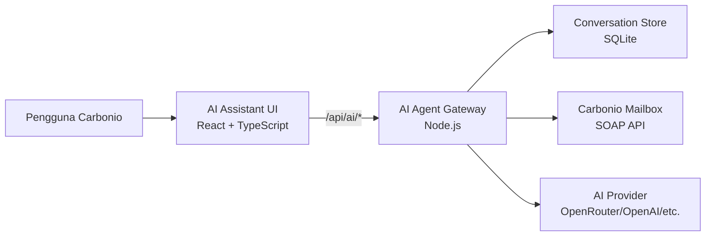

# Membangun AI Assistant untuk Carbonio Webmail

Bagaimana kalau pengguna webmail tidak hanya bisa membaca dan mengirim email,
tetapi juga dapat meminta bantuan AI untuk mencari pesan penting, meringkas
percakapan, dan menyiapkan balasan?

Pertanyaan tersebut menjadi awal dari proyek
[Carbonio AI Assistant](https://github.com/afatyoo/carbonio-ai-assitant), sebuah
add-on eksperimental untuk Carbonio Webmail. Proyek ini dimulai dari sebuah
tombol kecil bergambar robot, kemudian berkembang menjadi aplikasi AI dengan
antarmuka chat, pilihan provider dan model, penyimpanan riwayat di server, akses
email terkontrol, serta paket instalasi untuk server Carbonio.

Tulisan ini menceritakan proses pembuatannya, masalah yang ditemui, keputusan
arsitektur yang diambil, dan arah pengembangan selanjutnya.

> Catatan: versi `v0.0.1` masih merupakan MVP untuk pengujian. Audit keamanan,
> otorisasi, logging, database, dan kebijakan privasi provider AI tetap
> diperlukan sebelum digunakan di lingkungan produksi.

## Berawal dari tombol AI di sidebar

Target pertama terlihat sederhana: menambahkan tombol AI pada navigation bar
Carbonio, sejajar dengan aplikasi Mail dan Settings.

Namun, saya tidak ingin mengubah komponen Mail bawaan secara langsung. Jika
fitur AI ditanam terlalu dalam ke source code utama, proses upgrade Carbonio
akan menjadi sulit dan perubahan berisiko tertimpa. Karena itu, AI Assistant
dibuat sebagai microfrontend terpisah yang mengikuti mekanisme aplikasi pada
Carbonio Shell UI. Pendekatan ini mirip dengan konsep zimlet: fiturnya menyatu
dengan pengalaman pengguna, tetapi source code dan siklus rilisnya tetap
terpisah.

Setelah tombol robot dipilih, pengguna masuk ke halaman khusus dengan tiga area:

1. Navigation bar utama Carbonio.
2. Sidebar untuk daftar percakapan.
3. Area chat utama untuk berinteraksi dengan AI.

Prototype awal sengaja dibuat menyerupai aplikasi chatbot yang sudah familier.
Tujuannya bukan menyalin sebuah produk, tetapi mengurangi waktu belajar
pengguna. Mereka langsung memahami cara membuat percakapan baru, memilih saran
pertanyaan, dan mengirim prompt.

<!-- Tambahkan screenshot tampilan AI Assistant di sini. -->

## Kenapa frontend dan AI gateway dipisahkan?

Browser tidak boleh berkomunikasi langsung dengan provider AI menggunakan API
key. Jika key disimpan di frontend, siapa pun yang membuka developer tools dapat
melihat dan menyalahgunakannya.

Karena itu, proyek dibagi menjadi dua komponen utama:



### AI Assistant UI

Frontend dibuat menggunakan React dan TypeScript (`.tsx`) karena Carbonio Shell
UI sendiri memuat microfrontend berbasis teknologi web. Carbonio memang
memiliki backend berbasis Java, tetapi itu tidak berarti seluruh ekstensi harus
ditulis dalam Java. Java tetap menjalankan layanan mailbox, sedangkan React
menangani tampilan di browser.

Tanggung jawab frontend meliputi:

- menampilkan tombol dan halaman AI Assistant;
- mengelola interaksi chat;
- menampilkan daftar percakapan;
- menyediakan halaman pengaturan provider dan model;
- mengirim request melalui route internal `/api/ai`.

### AI Agent Gateway

Gateway adalah backend kecil berbasis Node.js yang hanya mendengarkan koneksi
lokal server. Nginx Carbonio meneruskan request `/api/ai/*` menuju gateway.

Gateway bertanggung jawab untuk:

- menyimpan API key agar tidak pernah dikirim kembali ke browser;
- memvalidasi sesi pengguna Carbonio;
- menghubungi provider AI;
- mengambil konteks email melalui API Carbonio;
- menyimpan percakapan secara persisten;
- membatasi tool yang boleh dijalankan AI.

Pemisahan ini membuat integrasi lebih aman dan memungkinkan provider AI diganti
tanpa membangun ulang seluruh frontend.

## Membuat pengaturan provider dan model

OpenRouter menyediakan banyak model, termasuk beberapa model gratis untuk
pengujian. Namun, memaksa pengguna memasukkan endpoint secara manual akan
membingungkan. Solusinya adalah menyediakan preset provider.

Versi awal mendukung pilihan:

- OpenRouter;
- OpenAI;
- Anthropic;
- DeepSeek;
- Gemini;
- custom endpoint.

Saat memilih provider yang sudah dikenal, endpoint diisi oleh sistem. Pengguna
cukup memasukkan API key dan memilih model. Custom endpoint tetap tersedia
untuk layanan internal, gateway perusahaan, atau provider lain yang belum
terdaftar.

Untuk pengujian OpenRouter, model gratis dapat dipilih melalui opsi model yang
tersedia pada akun pengguna. Daftar model sebaiknya tidak ditulis permanen di
frontend karena ketersediaan dan nama model dapat berubah. Gateway perlu
mengambil daftar tersebut dari provider dan memberikan fallback ketika
provider sedang tidak dapat diakses.

Konfigurasi sensitif disimpan di server. API key tidak disimpan di
`localStorage`, tidak dimasukkan ke repository, dan tidak dikirim kembali dalam
response konfigurasi.

## Menyimpan riwayat percakapan dengan benar

Prototype chat biasanya menggunakan `localStorage` karena cepat dibuat. Cara
tersebut tidak cukup untuk aplikasi webmail:

- history hanya tersedia pada satu browser;
- data hilang ketika storage dibersihkan;
- sulit menerapkan kebijakan retensi;
- isolasi data antarpengguna lebih sulit diaudit;
- perangkat lain tidak dapat membuka percakapan yang sama.

Karena itu, history dipindahkan ke backend dan disimpan menggunakan SQLite pada
versi MVP. Setiap conversation dikaitkan dengan identitas akun Carbonio yang
sudah tervalidasi. Gateway selalu memeriksa pemilik conversation sebelum
mengembalikan pesan.

SQLite dipilih untuk tahap awal karena instalasinya ringan dan tidak memerlukan
database tambahan. Untuk penggunaan besar atau high availability, storage ini
nantinya dapat diganti dengan PostgreSQL atau database lain yang didukung oleh
arsitektur operasional.

Fitur lifecycle conversation yang direncanakan selanjutnya adalah:

- mengubah nama percakapan;
- menghapus satu percakapan;
- menghapus seluruh history milik pengguna;
- pagination dan pencarian history;
- kebijakan retensi otomatis;
- audit event untuk operasi sensitif.

## Menghubungkan AI dengan email Carbonio

Chatbot biasa hanya menjawab berdasarkan prompt pengguna. AI Assistant untuk
webmail perlu memahami konteks mailbox, tetapi akses tersebut harus dibatasi.

Pada MVP, gateway menyediakan tool read-only untuk mencari dan membaca email.
Alurnya kurang lebih seperti ini:

1. Pengguna meminta AI mencari atau meringkas email.
2. Gateway memvalidasi sesi Carbonio.
3. Agent memilih tool mailbox yang sesuai.
4. Gateway menjalankan query melalui Carbonio SOAP API atas nama pengguna.
5. Hasil yang sudah dibatasi dikirim sebagai konteks ke model.
6. Model menyusun jawaban untuk pengguna.

Tool tidak menerima kredensial mailbox mentah. Ia menggunakan sesi aktif dan
tidak boleh mengakses akun lain. Jumlah email, panjang isi, jenis field, dan
rentang waktu juga perlu dibatasi agar data yang dikirim ke provider AI tidak
berlebihan.

Untuk aksi tulis seperti mengirim email atau membuat meeting, desainnya harus
lebih ketat. AI sebaiknya hanya menyiapkan draft terlebih dahulu. Pengguna harus
melihat detail penerima, isi, waktu, dan peserta, kemudian memberikan konfirmasi
sebelum aksi benar-benar dijalankan.

## Masalah nyata saat integrasi

Perjalanan dari prototype lokal ke server Carbonio menghasilkan beberapa
pelajaran penting.

### Response HTML dianggap sebagai JSON

Error berikut pernah muncul:

```text
Unexpected token '<', "<html>..." is not valid JSON
```

Karakter `<` menunjukkan bahwa frontend menerima halaman HTML, bukan response
JSON dari gateway. Penyebabnya adalah request masuk ke route atau virtual host
Nginx yang salah. Perbaikannya bukan mengubah JSON parser, melainkan memastikan:

- route `/api/ai/*` terpasang pada konfigurasi Nginx Carbonio yang benar;
- upstream mengarah ke port gateway;
- hostname dan TLS virtual host sesuai;
- gateway aktif dan dapat dijangkau dari Nginx.

### AI gateway mengembalikan HTTP 405

HTTP `405 Method Not Allowed` berarti route ditemukan, tetapi method request
tidak sesuai. Frontend dan gateway perlu menyepakati method, misalnya `POST`
untuk chat dan penyimpanan konfigurasi, serta `GET` untuk health check, model,
dan history.

### Request berhasil tetapi jawaban tidak muncul

Pada satu tahap, provider sudah mengembalikan status `200`, tetapi state React
tidak menerima jawaban dengan benar melalui implementasi streaming awal.
Untuk menstabilkan MVP, response chat diubah menjadi JSON biasa. Streaming dapat
dikembalikan kemudian setelah lifecycle koneksi, parsing event, timeout,
cancelation, dan error recovery diuji dengan baik.

Pelajarannya: status HTTP sukses belum menjamin pengalaman end-to-end sukses.
Pengujian harus mengikuti seluruh jalur dari browser, Nginx, gateway, provider,
kembali ke gateway, lalu sampai rendering UI.

## Menjalankan gateway sebagai service

Gateway dijalankan menggunakan `systemd`, bukan proses terminal manual. Service
ini otomatis dimulai saat server boot, dapat di-restart ketika gagal, dan
log-nya dapat diperiksa melalui journal.

Beberapa perintah operasional:

```bash
sudo systemctl status carbonio-ai-gateway
sudo systemctl restart carbonio-ai-gateway
sudo journalctl -u carbonio-ai-gateway -f
```

Gateway hanya bind ke `127.0.0.1:8787`. Akses dari browser harus melewati Nginx
Carbonio agar autentikasi, hostname, dan kebijakan jaringan tetap konsisten.

## Membuat paket instalasi

Agar pemasangan tidak bergantung pada folder development, repository menyediakan
script pembuat release:

```bash
pnpm install
pnpm run package:release
```

Script tersebut:

1. memastikan Git worktree bersih;
2. menjalankan TypeScript type-check;
3. membangun microfrontend;
4. memeriksa metadata commit hasil build;
5. mengemas UI, gateway, konfigurasi Nginx, unit systemd, installer, uninstaller,
   README, dan MIT License;
6. membuat checksum SHA-256.

Hasilnya berupa:

```text
carbonio-ai-assistant-v0.0.1.tar.gz
carbonio-ai-assistant-v0.0.1.tar.gz.sha256
```

Checksum diverifikasi sebelum instalasi:

```bash
sha256sum -c carbonio-ai-assistant-v0.0.1.tar.gz.sha256
```

Kemudian paket dapat diekstrak dan dipasang:

```bash
tar -xzf carbonio-ai-assistant-v0.0.1.tar.gz
cd carbonio-ai-assistant-v0.0.1
sudo ./install.sh
```

Installer memasang UI secara versioned, menyiapkan gateway, mendaftarkan service
systemd, memasang route Nginx, dan mempertahankan data persisten saat upgrade.

Uninstaller tersedia dengan perilaku aman:

```bash
sudo ./uninstall.sh
```

Secara default, konfigurasi dan database tetap dipertahankan agar data tidak
hilang tanpa sengaja. Penghapusan data memerlukan opsi eksplisit.

## Keamanan yang perlu diperhatikan

Integrasi AI dan email menyentuh data yang sensitif. Beberapa prinsip yang
digunakan atau perlu diterapkan adalah:

- API key hanya disimpan di server;
- gateway hanya mendengarkan koneksi loopback;
- setiap request terikat pada sesi dan akun Carbonio;
- conversation harus diisolasi berdasarkan pemilik;
- tool mailbox menerapkan least privilege;
- aksi tulis memerlukan konfirmasi manusia;
- prompt dan response sensitif tidak dicatat sembarangan;
- administrator dapat membatasi provider dan model;
- data yang dikirim ke provider dibuat seminimal mungkin;
- timeout, rate limit, ukuran request, dan audit log diterapkan;
- kebijakan retensi history dan dokumen ditentukan dengan jelas.

Prompt injection juga perlu diperlakukan sebagai risiko nyata. Isi email adalah
data yang tidak dipercaya. Instruksi yang tertulis di dalam email tidak boleh
secara otomatis dianggap sebagai perintah sistem atau izin untuk menjalankan
tool.

## Rencana setelah v0.0.1

Rilis pertama membuktikan bahwa microfrontend, gateway, provider AI, history,
dan mailbox dapat terhubung. Tahap selanjutnya berfokus pada:

1. rename, delete, search, dan pagination conversation;
2. observability, structured logging, health check, dan metrik;
3. tool untuk membuat draft balasan;
4. pembuatan jadwal meeting dengan preview dan konfirmasi;
5. RAG dokumentasi Carbonio;
6. RAG workspace yang tetap terisolasi per pengguna atau tenant;
7. kebijakan admin untuk provider, model, quota, dan tool;
8. database produksi dan strategi backup;
9. paket distribusi yang lebih native, misalnya `.deb`;
10. pengujian keamanan dan kompatibilitas lintas versi Carbonio.

RAG dokumentasi dan RAG mailbox sebaiknya dipisahkan. Dokumentasi Carbonio dapat
menjadi knowledge base bersama, sedangkan email dan dokumen pengguna harus
memiliki access-control filter pada proses indexing maupun retrieval.

## Pelajaran yang saya dapat

Proyek ini memperlihatkan bahwa menambahkan AI bukan hanya soal memanggil API
model. Bagian tersulit justru berada di sekeliling model:

- autentikasi dan otorisasi;
- pengelolaan secret;
- integrasi dengan aplikasi lama;
- penyimpanan history;
- desain tool yang aman;
- konfirmasi untuk aksi penting;
- deployment yang dapat diulang;
- debugging lintas browser, proxy, gateway, mailbox, dan provider.

Memulai dari MVP kecil membantu menguji asumsi satu per satu. Tombol robot
menjadi pintu masuk, chat dasar membuktikan alur UI, gateway mengamankan secret,
history server-side menjaga persistensi, dan paket release membuat hasilnya
dapat dipasang ulang.

Carbonio AI Assistant masih berada di awal perjalanan. Namun, versi `v0.0.1`
sudah menjadi fondasi untuk membangun asisten webmail yang tidak hanya bisa
menjawab pertanyaan, tetapi juga memahami konteks kerja dan membantu pengguna
melakukan pekerjaan dengan kontrol yang tetap berada di tangan manusia.

## Referensi proyek

- Repository:
  [github.com/afatyoo/carbonio-ai-assitant](https://github.com/afatyoo/carbonio-ai-assitant)
- Release:
  [Carbonio AI Assistant v0.0.1](https://github.com/afatyoo/carbonio-ai-assitant/releases/tag/v0.0.1)
- License:
  [MIT License](https://github.com/afatyoo/carbonio-ai-assitant/blob/main/LICENSE)

---

## Catatan untuk mengubah draft ini menjadi artikel publik

Sebelum dipublikasikan:

1. Tambahkan screenshot halaman utama, halaman Settings, dan daftar history.
2. Hapus hostname, alamat IP, token, API key, email, atau data internal dari
   seluruh gambar dan log.
3. Tambahkan nama penulis dan tautan profil pada metadata.
4. Sesuaikan gaya bahasa dengan media tujuan.
5. Uji ulang semua command pada server staging yang bersih.
6. Cantumkan versi Carbonio yang benar-benar sudah diuji.
7. Jelaskan bahwa proyek ini independen jika tidak berafiliasi resmi dengan
   Carbonio atau Zextras.
8. Minta review keamanan sebelum menyebut proyek siap produksi.
